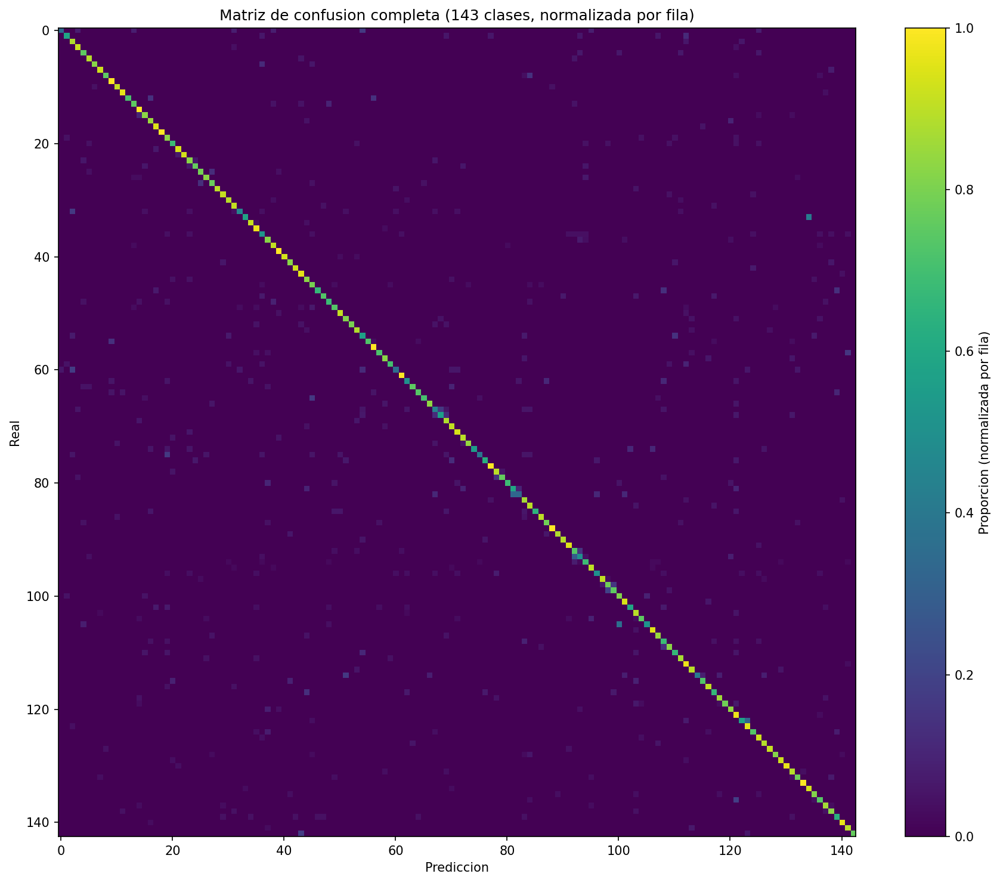
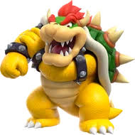

# Clasificación de Pokémon de Primera Generación con CNN

Autor: Mauricio Anguiano Juarez - A01703337
Módulo: Módulo 2 Inteligencia Artificial — Tec de Monterrey
Profesor: Benjamin Valdés Aguirre

---

## 1. Objetivo

Construir y evaluar una CNN que clasifique correctamente imágenes de 151 clases (los Pokémon de la primera generación), haciendo preparación del dataset, train/validation split, data augmentation, transfer learning, evaluación de modelo y guardado/carga del modelo en Keras.

---

## 2. Dataset y justificación de su elección

Nombre: pokemon-images-first-generation17000-files
Fuente: Kaggle — autor mikoajkolman
Tamaño: ~17,000 imágenes organizadas en 151 carpetas (una por Pokémon). Al descargar, el dataset expone 143 carpetas válidas con imágenes, por lo que NUM_CLASSES = 143 en la práctica.

### ¿Por qué este dataset y no otro?

| Criterio | Decisión tomada | Razón |
|---|---|---|
| Tipo de problema | Clasificación multi-clase de imágenes | En el módulo se vieron CNNs binarias (cats vs dogs) o de 10 clases (Fashion MNIST); 151 clases sube la dificultad sin salirse del alcance. |
| Tamaño | ~17,000 imágenes / ~110 por clase | Suficiente para split 80/20 y data augmentation, evitando sobreajuste de datasets pequeños. |
| Estructura | Carpetas por clase | Compatible con ImageDataGenerator.flow_from_directory(), igual que cats vs dogs. |
| Originalidad | Pokémon es un interes personal diferente a los vistos en clase | Caso propio sin alejarse de la temática de clasificación de imágenes. |

---

## 3. Herramientas
- Python 3 + Google Colab (GPU).
- TensorFlow / Keras.
- kagglehub, numpy, pandas, matplotlib, seaborn, scikit-learn, PIL.

---

## 4. Estructura del repositorio

| Archivo | Contenido |
|---|---|
| `README.md` | Documentación del proyecto (este archivo). |
| `PokemonCNN.ipynb` | Notebook principal: descarga y preprocesado del dataset, Modelo 1 (MobileNetV2), Modelo 2.0 (EfficientNetV2-S con mejoras, ver sección 8) y comparación de modelos. |
| `pokemon_cnn_pruebas.ipynb` | Demo de predicción: carga los modelos `.h5` ya entrenados y clasifica imágenes (no entrena). |
| `pokemon_cnn_best.h5` | Pesos del **Modelo 1** (MobileNetV2, 128×128, val_acc 0.81). |
| `pokemon_effnet_best.h5` | Pesos del **Modelo 2** (EfficientNetB0, 224×224, mejor checkpoint 0.92). |
| `pokemon_effv2s_best.h5` | Pesos del **Modelo 2.0** (EfficientNetV2-S, 224×224, **val_accuracy 0.96**), la versión más fuerte. |

---

## 5. Enlace al notebook

Google Colab:
https://drive.google.com/file/d/1AcBZhYBGJDCSg_eWWzxFB2ccEsTyt9YU/view?usp=sharing

---

## 6. Avance 2 — Modelo, evaluación inicial e interpretación

### 6.1 Modelo implementado (baseline ejecutado)

El primer modelo usa **transfer learning** sobre **MobileNetV2** (Sandler et al., 2018)
preentrenada en ImageNet, una arquitectura del estado del arte para clasificación de
imágenes en entornos con cómputo limitado (como Colab). La idea de reutilizar redes
preentrenadas como extractores de características generales está documentada en Sharif
Razavian et al. (2014), quienes muestran que las características de una CNN entrenada en
ImageNet funcionan como un baseline sorprendentemente fuerte para tareas nuevas.

Configuración:
- Backbone MobileNetV2 con `include_top=False`, congelada en la fase 1.
- Cabeza de clasificación: `GlobalAveragePooling2D → Dropout(0.3) → Dense(256, ReLU) → Dropout(0.3) → Dense(143, softmax)` sobre las 143 clases efectivas.
- Entrada 128×128, rescalado `1./255`, data augmentation solo en entrenamiento (rotación, shift, zoom, flip).
- Optimizador Adam; callbacks `ModelCheckpoint`, `EarlyStopping`, `ReduceLROnPlateau`.
- Fase 2 (fine-tuning): se descongelan las últimas 30 capas de la base y se reentrena con learning rate menor.

### 6.2 Métricas y resultados

La evaluación usa la accuracy global, además de precision, recall y F1 por clase
(`classification_report`) y la matriz de confusión, que es la metodología estándar para
clasificación multi-clase.

| Métrica | Valor (baseline / Modelo 1) |
|---|---|
| Muestras de entrenamiento | 13,246 |
| Muestras de validación | 3,239 |
| Clases efectivas | 143 (el dataset expone 143 carpetas con imágenes, no 151) |
| **val_accuracy** | **0.81** (medido: 0.8114) |
| macro-F1 / weighted-F1 | 0.80 / 0.81 (precision macro 0.82) |

### 6.3 Interpretación

- Un accuracy de ~81% sobre 143 clases es un resultado sólido para un baseline: el azar
  daría ~0.007% (1/143), por lo que el modelo aprende características discriminativas reales.
- En el `classification_report` por clase, muchos Pokémon alcanzan F1 altos (0.80–0.95),
  mientras que las clases con pocas imágenes o muy parecidas a otras (problema de tipo
  *fine-grained*) son las que bajan el desempeño.
- Las confusiones esperables ocurren entre Pokémon visualmente similares y entre etiquetas
  casi duplicadas del dataset (p. ej. "Mr. Mime" vs "MrMime"), lo cual es una limitación
  del dataset más que del modelo.

### 6.4 Matriz de confusión 

Como una matriz de 143 columnas no es legible con números, lo más informativo es el listado de **clases con más errores** y de **pares (real → predicho)** que más se confunden.

**Top de Pokémon con más errores:**

| Pokémon (real) | Errores / muestras |
|---|---|
| Pinsir | 13 / 26 |
| Electabuzz | 13 / 24 |
| Farfetch'd | 12 / 25 |
| Starmie | 12 / 28 |
| Rapidash | 12 / 25 |
| Pidgey | 12 / 38 |
| Pidgeotto | 12 / 24 |
| Marowak | 11 / 18 |
| Primeape | 11 / 27 |
| Kadabra | 11 / 17 |

**Confusiones concretas más frecuentes (real → predicho):** 
- Starmie → Staryu (9 veces)
- Rapidash → Ponyta (9)
- Pidgeotto → Pidgeot (7)
- Wartortle → Squirtle (5)
- Electrode → Voltorb (5)
- Poliwhirl → Poliwrath (5)
- Jolteon → Zapdos (4).

Casi todas las confusiones caen entre **el mismo Pokémon en distinta etapa
evolutiva** o **Pokémon del mismo tipo y silueta** . Es el problema clásico de clasificación *fine-grained*: distinguir clases visualmente casi idénticas. 

---

## 7. Comparación de modelos
Se nos pidió realizar mejoras al mejor modelo que teníamos previamente para despues compararlas y que la segunda supere a la primera. La progresión fue de **tres modelos** (todos
evaluados sobre el mismo set de validación: 3,239 imágenes, 143 clases):

| Modelo | Backbone | Artículo | val_accuracy |
|---|---|---|---|
| **Modelo 1** | MobileNetV2 | Sandler et al. (2018) | **0.81** |
| **Modelo 2** | EfficientNetB0 | Tan & Le (2019) | **0.92** |
| **Modelo 2.0** | EfficientNetV2-S | Tan & Le (2021) | **0.96** (0.9583) |

#### Comparación 1 — Modelo 1 vs Modelo 2 (MobileNetV2 → EfficientNetB0): 0.81 → 0.92

Cambiar el backbone de MobileNetV2 a **EfficientNetB0** y subir la resolución de entrada de 128×128 a
224×224 mejoró el accuracy de **0.81 a 0.92 (+11 puntos)**. El *escalado compuesto* de EfficientNet
(equilibra profundidad, anchura y resolución) extrae características más discriminativas, clave en un problema *fine-grained* de 143 clases con Pokémon visualmente parecidos.

#### Comparación 2 — Modelo 2 vs Modelo 2.0 (EfficientNetB0 → EfficientNetV2-S): 0.92 → 0.96

Aquí entran las **3 mejoras** backbone **EfficientNetV2-S** (bloques *Fused-MBConv*), **augmentation más fuerte + label smoothing**, y una **receta de entrenamiento corregida** (fine-tuning profundo de 60 capas y evaluación del mejor checkpoint). El accuracy sube de **0.92 a 0.9583 (+3.8 puntos)**. El **fine-tuning fue decisivo**: con la base congelada (solo la cabeza) el Modelo 2.0 se estancó en ~0.887, y al descongelar las últimas 60 capas con learning rate bajo (1e-4) subió de forma sostenida hasta 0.9583.

### Ejemplos visuales — imágenes de prueba (antes vs después)

Estas son las imágenes que se probaron con el profesor (`test_images/pruebaBenji*`), clasificadas con los modelos **antes** de las mejoras (MobileNetV2, EfficientNetB0) y **después** (EfficientNetV2-S, Modelo 2.0).

| Imagen | Antes · MobileNetV2 | Antes · EfficientNetB0 | Después · EfficientNetV2-S (2.0) |
|:---:|:---:|:---:|:---:|
|  | Mewtwo 32.5% | Machop 55.9% | Dewgong 8.7% |
|  | Hypno 53.6% | Kangaskhan 59.0% | Kangaskhan 13.6% |
|  | Scyther 19.7% | Mewtwo 49.8% | **Mewtwo 97.3%** |

---

## 8. Mejoras (Modelo 2.0 — EfficientNetV2-S)

**Mejora 1 — Backbone más potente y moderno: EfficientNetV2-S.**
EfficientNetV2 (Tan & Le, 2021) introduce bloques *Fused-MBConv* y un esquema de entrenamiento más eficiente; su variante *S* tiene más capacidad y mejor preentrenamiento en ImageNet que EfficientNetB0, por lo que se espera mayor accuracy en un problema *fine-grained* de 143 clases. Se instancia con `tf.keras.applications.EfficientNetV2S`. La normalización de píxeles va dentro del modelo, así que las imágenes se alimentan en el rango [0,255].

**Mejora 2 — Regularización más fuerte: data augmentation enriquecido + label smoothing.**
El aumento de datos del Modelo 2.0 es más agresivo que el del baseline: además de rotación,
desplazamientos, zoom y flip horizontal, añade *shear* (cizalla) y variación de brillo
(`brightness_range=[0.8, 1.2]`). Además se entrena con `label_smoothing=0.1` en la pérdida
`CategoricalCrossentropy`. Ambas técnicas reducen el sobreajuste y mejoran la generalización cuando hay
muchas clases con pocas imágenes cada una.

**Mejora 3 — Receta de entrenamiento corregida y más profunda.**
1. *Callbacks independientes por fase.* En el Avance 2, reutilizar la misma instancia de callbacks entre la fase de cabeza y la de fine-tuning hacía que `EarlyStopping` arrastrara su mejor valor previo y el modelo final terminara por debajo del mejor checkpoint. Aquí cada fase usa callbacks nuevos y, con `ModelCheckpoint(initial_value_threshold=best_fase1)`, el archivo `pokemon_effv2s_best.h5` siempre conserva el **mejor modelo global**.
2. *Fine-tuning más profundo.* Se descongelan las **últimas 60 capas** del backbone (vs 30 en los modelos previos), con un learning rate bajo (1e-4) para ajustar más representaciones sin destruir los pesos preentrenados.
3. *Se evalúa el mejor checkpoint.* Al final se recarga `pokemon_effv2s_best.h5` y se mide sobre el set de validación, de modo que la accuracy reportada del Modelo 2.0 corresponde a su mejor modelo real (no al modelo posterior al fine-tuning).

---

## 9. Referencias

**Arquitecturas y técnicas:**
- Sandler, M., Howard, A., Zhu, M., Zhmoginov, A., & Chen, L.-C. (2018). *MobileNetV2:
  Inverted Residuals and Linear Bottlenecks.* IEEE/CVF CVPR. arXiv:1801.04381 — backbone del **Modelo 1**
  (`tf.keras.applications.MobileNetV2`).
- Tan, M., & Le, Q. (2019). *EfficientNet: Rethinking Model Scaling for Convolutional Neural
  Networks.* ICML. arXiv:1905.11946 — escalado compuesto; backbone del **Modelo 2**
  (`tf.keras.applications.EfficientNetB0`, mejor checkpoint 0.92).
- Tan, M., & Le, Q. (2021). *EfficientNetV2: Smaller Models and Faster Training.* ICML.
  arXiv:2104.00298 — backbone del **Modelo 2.0** (`tf.keras.applications.EfficientNetV2S`).
- Szegedy, C., Vanhoucke, V., Ioffe, S., Shlens, J., & Wojna, Z. (2016). *Rethinking the Inception
  Architecture for Computer Vision.* CVPR. arXiv:1512.00567 — origen del **label smoothing**
  (`label_smoothing=0.1`) usado en la pérdida del Modelo 2.0.